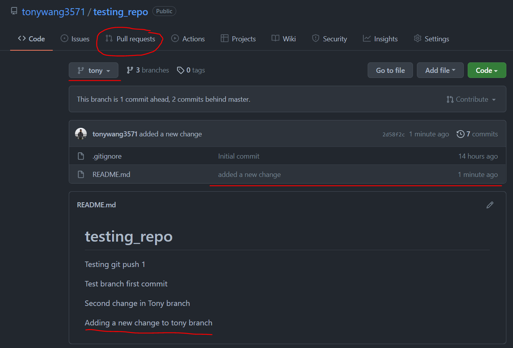
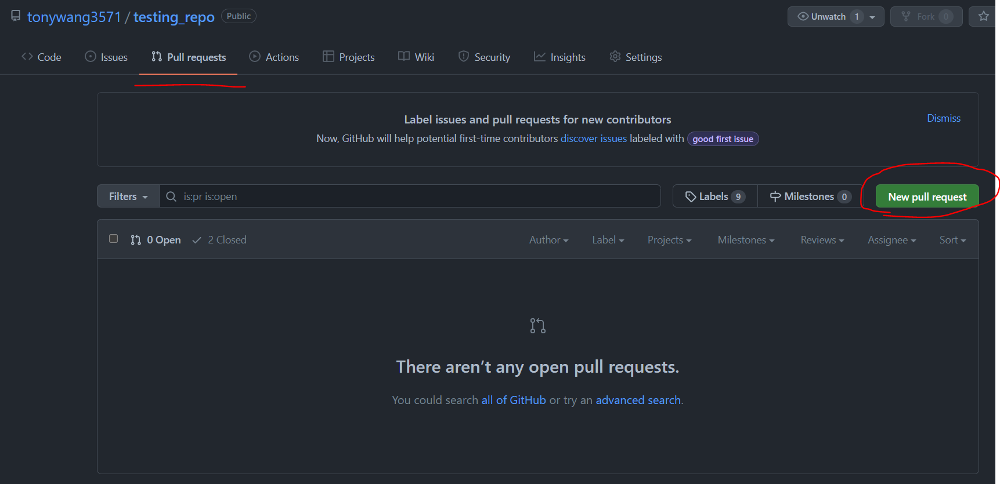
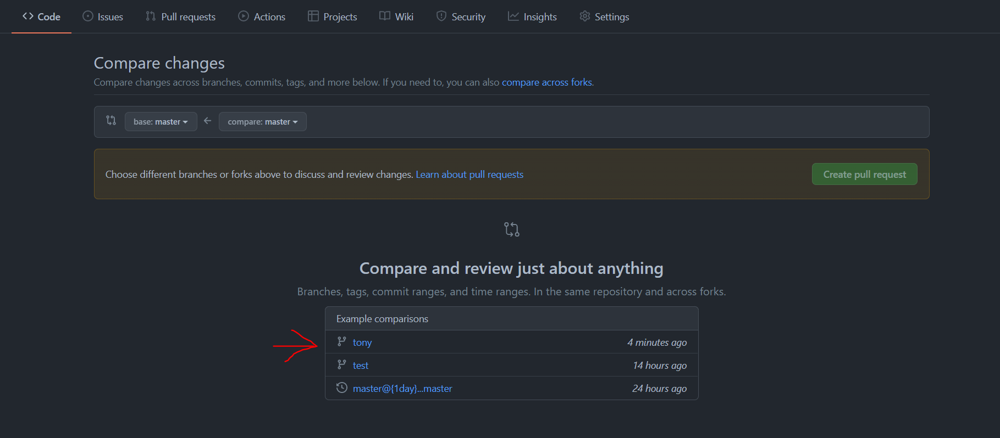
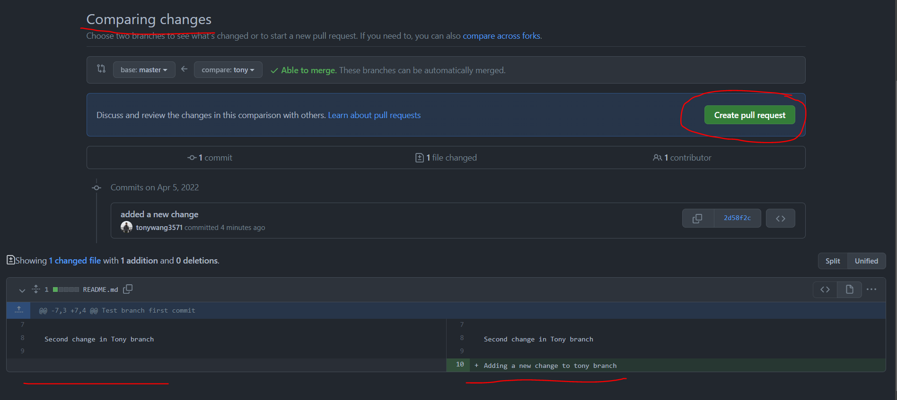

# Final_Project_Repo  
Group Final Project  

1. Create new folder and initialize folder as repository (git init)  

2. Clone "Final_Project_Repo" from github (git pull repo_url)  
(i.e. git pull git@github.com:tonywang3571/Final_Project_Repo.git)  

3. Create personal branch (git checkout -b branch_name)  
(i.e. git checkout -b tony)  
- Switch between branches, probably don't need to do this very often (git checkout branch_name)  
(i.e. git checkout tony)  

4. Start working and make edits under your personal branch!  

5. Push often after making edits and working on the project.  
- check status of your working branch (git status)
- add 1 file changed to be commited and pushed (git add file_name) (i.e. git add README.md) OR  
add ALL files changed to be commited and pushed (git add .) <-- this is what I normally do  
- commit changes with a message/note (git commit -m "message/note")
- push changes (git push repo_url) (i.e. git push git@github.com:tonywang3571/Final_Project_Repo.git)

6. Pull request to merge into 'master' branch (I use master not main, no real difference just what's easier for me).  
(Follow the images below. Basically you'll click the 'create pull request' button and add messages/notes and comments)
  
  
  
  
